# RuYiCode 0.4.4 插件测试报告

| 项目 | 内容 |
| --- | --- |
| 被测件 | `ruyicode-0.4.4.vsix`（插件标识 `local.ruyi-code`，版本 0.4.4） |
| 测试方式 | 在 VS Code 1.138.0 界面上逐条执行《RuYiCode 插件完整测试流程》第 4 节用例 |
| 测试人 | ＿＿＿＿＿＿ |
| 测试日期 | ＿＿＿＿＿＿ |
| 已确认缺陷 | **6 条**（2.1、B1、B3、B5、C3、C5） |
| 已实测通过 | 3 条用例（A2 连接弹窗、B1 面板控件、B2 流式回答） |

> 本报告只收录测试人员在实际界面操作中亲自发现并确认的缺陷。
> 缺陷编号一般沿用发现该问题的测试用例编号（与流程文档的 A1、B1、C5 这套编号一致）；
> 若问题出在某个流程环节而非某条用例上，则使用该环节的编号（如 2.1）。

---

## 一、测试环境

| 项目 | 内容 |
| --- | --- |
| 操作系统 | Windows 11 专业版，Build 26200 |
| 处理器 / 内存 | Intel Core i7-8700（6 核 12 线程）/ 15.9 GB |
| VS Code | 1.138.0 |
| 推理引擎 | llama.cpp b11223（Windows CPU 版），端口 8080 |
| 模型 | Qwen2.5-Coder-1.5B-Instruct-Q4_K_M（约 1.07 GB） |
| 其它环境 | 未安装 WSL；未安装 Ollama；Git Bash 装在 `D:\Git` |

**引擎启动命令**（在 PowerShell 中执行，窗口需保持打开）：

```powershell
$L = 'C:\Users\2025111355\Desktop\RuyiCode测试材料\llama-b11223-bin-win-cpu-x64 (1)'
& "$L\llama-server.exe" -m "$L\models\qwen2.5-coder-1.5b-instruct-q4_k_m.gguf" -c 4096 --port 8080 --alias qwen2.5-coder-1.5b-instruct-q4_k_m
```

窗口中出现 `listening on http://127.0.0.1:8080` 表示启动成功，按 Ctrl+C 停止。

**插件设置**（Ctrl+, 搜 RuyiCode）：

- Engine Type：`llama-server`（默认值）
- Endpoint：`http://127.0.0.1:8080/v1`（默认值）
- Llama.cpp 根目录：填上面 `$L` 那个路径

---

## 二、缺陷汇总

| 编号 | 严重程度 | 涉及用例 | 问题概述 |
|---|---|---|---|
| **B1** | 一般 | B1 | ① 面板过窄时刷新按钮 ↻ 与状态圆点被裁掉 ② 点刷新不会更新连接状态圆点（含 2 个问题） |
| **B3** | 一般 | B3 | 按 Esc 取消生成后，已输出的内容不会保留，被替换成「生成失败: aborted」 |
| **B5** | 严重 | B5 | ① 对话不具备多轮记忆，模型看不到自己上一轮的回答　② 「讨论选中代码」后会残留永久转圈的「正在输入」气泡（含 2 个问题） |
| **C3** | 一般 | C3 | 「生成注释」把 markdown 围栏和重复的代码一起塞进注释块 |
| **C5** | 一般 | C5 | ① CodeLens 对 Python 文件不出现　② 点「解释」退化为解释整个文件（含 2 个问题） |

---

## 三、缺陷详情


### B1（一般）AI 对话面板工具栏相关问题

> 本编号对应测试用例 B1，共包含 2 个问题。

#### 问题 1：面板过窄时工具栏控件被裁掉

##### 现象

AI 对话面板宽度较小时，顶部工具栏右侧的刷新按钮 ↻ 和连接状态圆点完全看不见，被裁在可视区域之外。把面板拖宽后才会出现。

##### 复现步骤

1. 按 `Ctrl+Alt+L` 打开 AI 对话面板。
2. 把面板宽度拖窄到约 305 px。
3. 观察面板顶部工具栏。
4. 再把面板拖宽到约 379 px，再次观察。

##### 实测结果

| 面板宽度 | 显示情况 |
|---|---|
| 305 px | 只看到模型下拉框，**刷新按钮 ↻ 与状态圆点消失** |
| 379 px | 下拉框、↻、状态圆点**均正常显示** |

两者宽度只差 74 px。

##### 影响

- 窄面板下用户找不到刷新模型列表的入口。
- 看不到连接状态圆点，无法判断引擎是否连上，而这是 B1 用例要求检查的界面元素之一。
- 现象容易被误判为「插件没有这个功能」，而不是布局问题。

##### 证据

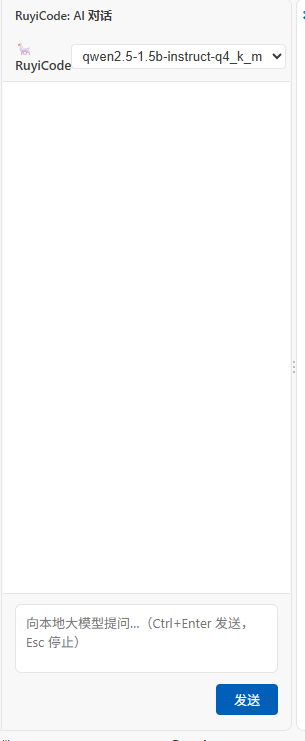

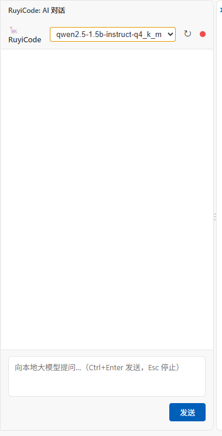

#### 问题 2：点击「刷新」不会更新连接状态圆点

##### 现象

引擎工作正常（模型下拉框能取到模型名），但工具栏右侧的连接状态圆点显示为**红色**，含义是「引擎未连接」。点击刷新按钮 ↻ 之后，圆点**颜色不变，仍是红色**。

##### 复现步骤

1. 打开 AI 对话面板，确认模型下拉框里已经显示出模型名（说明插件能从引擎取到模型列表，引擎是通的）。
2. 观察工具栏右侧的连接状态圆点颜色。
3. 点击刷新按钮 ↻，等模型列表刷新完成。
4. 再次观察圆点颜色。

##### 实测结果

- 模型下拉框内容正常，说明引擎可访问（实测直接请求引擎的 `/models` 返回 HTTP 200，48 ms）。
- 圆点始终为**红色**。
- 点击 ↻ 之后圆点没有任何变化。

##### 原因（代码定位）

刷新这条链路**前后端两处都断了**。

**后端** `out/features/chatView.js:137-140`：

```js
case 'refreshModels':
    await this.engine.refresh();
    this.send({ type: 'models', models: this.engine.availableModels, currentModel: this.currentModel });
    break;                                    // ← 只发了 models，没有发 status
```

对比「切换模型」的分支（同一文件 130-135 行），那边是发的：

```js
case 'setModel':
    if (msg.model) {
        ...
        this.send({ type: 'status', connected: this.isConnected() });   // ← 这里才发
    }
    break;
```

**前端** `media/chat/chat.js:170-182`：

```js
case 'init':
    fillModels(msg.models, msg.currentModel);
    updateConn(msg.connected);        // ← 只有 init 会更新圆点
    break;
case 'models':
    fillModels(msg.models, msg.currentModel);
    break;                            // ← 收到 models 不调用 updateConn
case 'status':
    updateConn(msg.connected);        // ← 只有切换模型时才会收到
    break;
```

也就是说：**即使后端补发了 status，前端也会因为收到的是 models 而不更新圆点；反过来即使前端在 models 分支加了更新，后端也没把状态放进消息里**。任一处修好都还需要另一处配合。

##### 颜色逻辑（`media/chat/chat.css`）

```css
.dot      { width:10px; height:10px; border-radius:50%; display:inline-block; }
.dot.ok   { background: #4ec9b0; }   /* 青绿色 = 引擎已连接 */
.dot.err  { background: #f14c4c; }   /* 红色   = 引擎未连接 */
.dot.idle { background: #666;    }   /* 灰色   = 尚未探测 */
```

前端只有一个函数负责改颜色（`chat.js:242-245`）：

```js
function updateConn(connected) {
    connDot.className = 'dot ' + (connected ? 'ok' : 'err');
    connDot.title = connected ? '引擎已连接' : '引擎未连接';
}
```

它**只会设 `ok` 或 `err`，从来不设 `idle`**。所以 CSS 里专门定义的灰色「尚未探测」状态实际上用不到 —— 只要插件还没确认连上，圆点就一律显示为红色的「未连接」。

另外，插件的定时探测**只在托管模式下启用**（`engineManager.js:111` 附近，注释写着「仅在托管模式下启用，避免打扰外部引擎」）。手动启动引擎时插件不会自动重新探测，因此这个状态一旦错了就会一直错下去，只能靠关闭再打开面板（触发 init）或切换模型（触发 status）来纠正。

##### 影响

- 用户看到红色圆点会认为引擎断了，但引擎其实完全正常。
- 点「刷新」也修不好，因为刷新这条路径根本不更新圆点，用户会以为插件坏了。
- 这是测试用例 B1 明确要求检查的界面元素（「连接状态圆点」），而它显示的状态**不可信**。

##### 证据

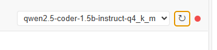

---


### B3（一般）按 Esc 取消生成后，已输出的内容不会保留

#### 现象

对话回答正在逐字输出时按 Esc（或点停止按钮），生成立即停止，但界面上已经显示出来的那部分回答会消失，整块被一条错误提示取代：

> 生成失败: aborted

#### 复现步骤

1. 按 `Ctrl+Alt+L` 打开 AI 对话面板。
2. 发送一个回答较长的问题，例如：`请你介绍一下 RISC-V`
3. 等回答开始逐字出现、界面上已经显示出若干行之后，按 Esc。
4. 观察先前已经显示出来的那部分回答。

#### 实测结果

- 生成确实**立即停止**了。
- 但先前已经显示出来的回答内容**没有保留**，整块被替换成红色提示「生成失败: aborted」。

#### 与文档的对照

流程文档 4-B3 用例的要求是：

> 回答过程中按 Esc → 生成立即停止，**已输出内容保留**

实测中「立即停止」符合，但「已输出内容保留」不符合。

#### 影响

- 用户中途打断后，已经生成的内容全部丢失，需要重新提问。
- 弹出的「生成失败」提示会让用户误以为插件出了故障，而不只是自己主动中止。

#### 证据

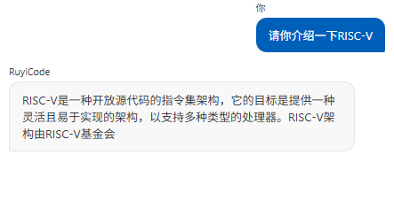

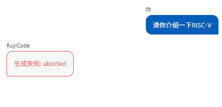

---

### B5（严重）AI 对话相关问题（多轮记忆失效 / 残留转圈气泡）

> 本编号对应测试用例 B5，共包含 2 个问题。

#### 问题 1：模型看不到自己上一轮的回答

##### 现象

连续追问时，模型看不到自己上一轮给出的回答。

##### 复现步骤

1. 按 `Ctrl+Alt+L` 打开 AI 对话面板。
2. 发送：`请编造一个英文代号，格式严格为三个大写字母-三位数字，例如 ABC-123。只回答代号本身。`
3. 记下模型给出的代号。
4. 等回答结束后，接着发送：`请原样重复我上一条消息中你给出的那个代号。只回答代号本身。`

##### 实测结果

| 轮次 | 内容 |
|---|---|
| 用户 | 请编造一个英文代号……例如 ABC-123…… |
| RuyiCode | **DEF-456** |
| 用户 | 请原样重复我上一条消息中你给出的那个代号 |
| RuyiCode | **ABC-123** ← 错误 |

第 4 步模型回答的是 `ABC-123`，也就是第 2 步提问里作为**格式示例**写进去的字符串，并不是它自己生成的 `DEF-456`。说明模型在第二轮看不到自己上一轮的回答。

##### 影响

「AI 对话」实际是无状态的单轮问答。用户追问时必须把之前的上下文重新贴一遍，否则模型不知道「上面那个」指的是什么。

##### 证据

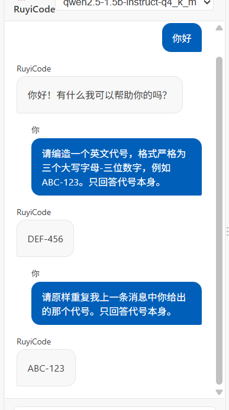

#### 问题 2：用「在对话中讨论选中代码」后会留下一个永久转圈的「正在输入」气泡

##### 现象

通过右键「RuyiCode: 在对话中讨论选中代码」发起提问后，回答能正常出现，但对话区里残留一个一直转圈的「●●●」气泡，永远不会消失。

##### 复现步骤

1. 用 VS Code 打开 `demo.js`，选中一段代码。
2. 在选中区域上点右键，选「**RuyiCode: 在对话中讨论选中代码**」。
3. 等这一轮回答结束。
4. 在回答区域里找一个停在「●●●」状态的转圈气泡。

##### 实测结果

正常回答之外，还会多出一个停在三点动画上的气泡，一直转下去，不会消失。

普通聊天（在输入框里提问）不会出现这个现象，只有走「讨论选中代码」这条路径才会。

##### 原因（代码定位）

这条路径会**发出两次 `chatStart`**。

`out/features/chatView.js:64-69`（`ChatViewProvider.open`）：

```js
if (inst.view) {
    inst.send({ type: 'chatStart' });            // ← 第 1 次
    void inst.submitUserMessage(initialText);    // ← 它内部还会再发一次
}
```

`out/features/chatView.js:99-104`（`resolveWebviewView` 里处理待发文本的分支）是同样的写法：

```js
if (this.pendingText) {
    const text = this.pendingText;
    this.pendingText = '';
    this.send({ type: 'chatStart' });            // ← 第 1 次
    void this.submitUserMessage(text);            // ← 内部又发一次
}
```

而 `submitUserMessage` 的第一行就是（同文件 149 行）：

```js
this.send({ type: 'chatStart' });                // ← 第 2 次
```

前端每收到一个 `chatStart` 就新建一个气泡，并把引用覆盖掉（`media/chat/chat.js:183-187`）：

```js
case 'chatStart':
    setStreaming(true);
    currentAssistantEl = showTyping();   // ← 第二次把上一次的引用覆盖掉
    currentAssistantText = '';
    break;
```

第一个气泡被创建之后，再没有任何代码会去更新它 —— 只有 `currentAssistantEl` 指向的那个气泡才接收 `chatDelta`。而 `chatDone` 也只把 `currentAssistantEl` 置空，并不删除 DOM 元素（`chat.js:200-207`）：

```js
case 'chatDone':
    setStreaming(false);
    if (currentAssistantEl && currentAssistantText) { ... }
    currentAssistantEl = null;      // ← 只置空，不删元素
    ...
```

所以第一个气泡永远停在 `showTyping()` 的三点动画上。

##### 影响

- 界面残留一个永远转圈的「正在输入」指示，用户会以为还有内容正在生成，不知道该等还是该操作。
- 只有通过「在对话中讨论选中代码」这条入口才会出现，普通聊天只发一次 `chatStart`，所以平时看不到。
- 「讨论选中代码」是插件主推的入口之一（右键菜单里的第 8 条命令），走这个入口的用户每次都会踩到。

##### 证据

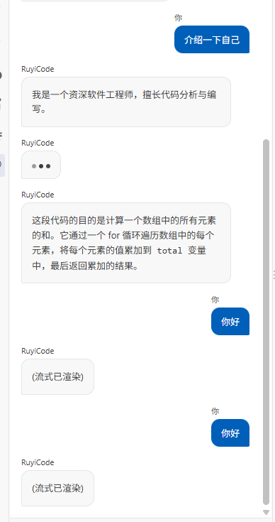

---

### C3（一般）「生成注释」把代码和围栏一起塞进了注释块

#### 现象

点击函数上方的「📝 生成注释」后，插入的不是注释，而是一大段**注释包着重复代码**的内容：
markdown 的三反引号、模型自己输出的 JSDoc 块、以及**整段重复的函数体**，全都被包进了 `/** ... */` 里。

#### 复现步骤

1. 用 VS Code 打开 `demo.js`。
2. 点击 `sum` 函数上方的「📝 生成注释」。
3. 观察插入到函数上方的内容。

#### 实测结果

插入的内容长这样（共 16 行）：

```js
/**
 * ```javascript
 * /**
 *  * 计算一组数字的总和
 *  * @param {number[]} numbers - 要计算的数字数组
 *  * @returns {number} - 数字的总和
 *  */
 * function sum(numbers) {
 *   let total = 0;
 *   for (const n of numbers) {
 *     total += n;
 *   }
 *   return total;
 * }
 * ```
 */
function sum(numbers) {
  ...
}
```

函数本身没有被破坏（这一点是对的），但插入的注释内容完全不可用。

#### 与文档的对照

流程文档 4-C3 的要求是：

> 注释被**插入到选中代码上方**（直接改文件，可 Ctrl+Z 撤销）

实际插入的是「注释 + 代码」的混合体，不是注释。

#### 原因（代码定位）

`out/features/codeComment.js:286`：

```js
const commentBody = res.text.trim();          // ← 模型原始输出，未做任何清理
...
const commentText = toCommentText(commentBody, doc.languageId);
```

`toCommentText`（同文件 430-449 行）只是把**每一行**前面加上 ` * ` 再包进 `/** */`，既不剥离围栏也不剥离代码：

```js
const useBlock = BRACKET_LANGS.has(languageId) && alreadyCommented < 0.5;
if (useBlock) {
    const inner = lines.map((l) => (l.trim() ? ` * ${l.trimEnd()}` : ' *')).join('\n');
    return `/**\n${inner}\n */`;
}
```

三个问题叠在一起：

1. **没有剥离 markdown 代码围栏。** 同文件 347 行有一个现成的 `extractCode()` 专门做这件事，但只用在了反方向（「注释生成代码」），生成注释这边没有调用。
2. **没有剥离模型回显的代码。** 让模型「给这段代码写注释」，它把代码一并返回是相当普遍的行为。
3. **「是否已经是注释」的判断被回显代码稀释。** 模型返回的 14 行里只有 5 行以注释符号开头（约 36%），低于 0.5 的阈值 → 判定为「还不是注释」→ 又套了一层。如果代码没有被回显，这个比例会超过 0.5，就不会重复包裹。

#### 影响

- 每用一次就往文件里塞 16 行以上垃圾内容，用户必须 Ctrl+Z 撤销后重来。
- 界面只提示「注释已插入到代码上方」，不提示内容有问题。
- 该功能在实际使用中不可用。

#### 证据

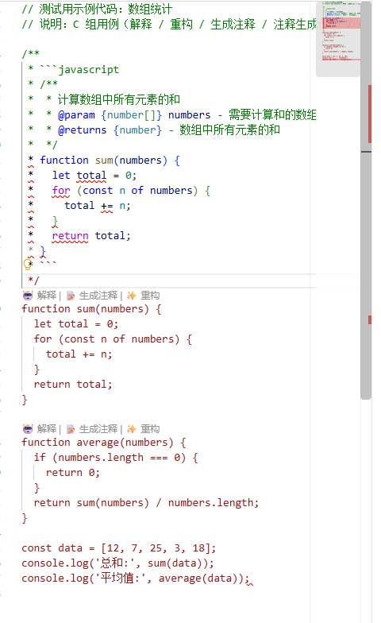

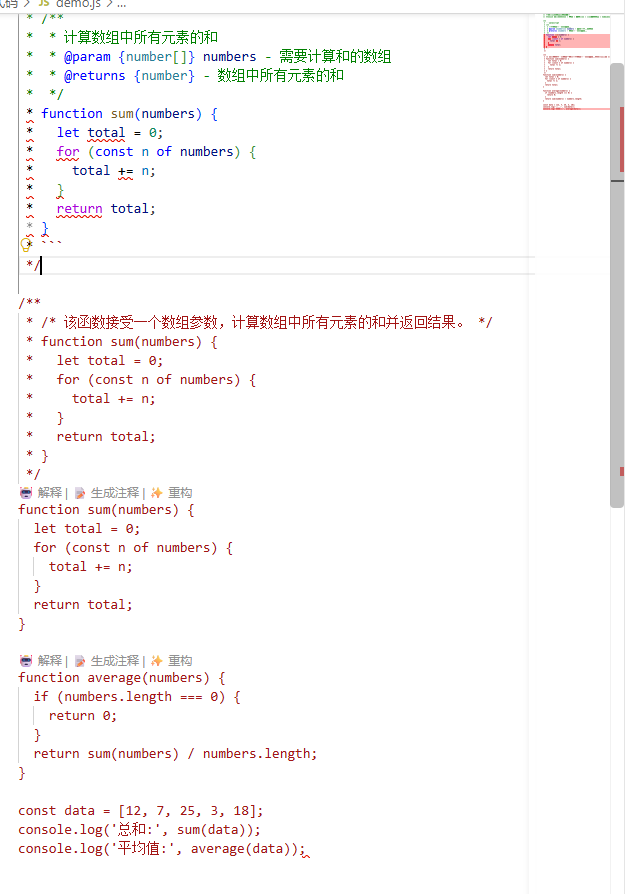

---

### C5（一般）代码提示入口（CodeLens）相关问题

> 本编号对应测试用例 C5，共包含 2 个问题。

#### 问题 1：CodeLens 对 Python 文件不出现

##### 现象

在 JavaScript 文件中，函数上方会出现三个可点击的入口「🤖 解释 / 📝 生成注释 / ✨ 重构」；
在 Python 文件中，同样写法的函数上方**什么都不出现**。

##### 复现步骤

1. 用 VS Code 打开 `demo.js`（其中有两个函数：`sum` 和 `average`）。
2. 观察函数名**上方**那一行。
3. 再打开 `demo.py`（其中有两个函数：`sum_numbers` 和 `average`）。
4. 观察函数名上方那一行。

##### 实测结果

| 文件 | 函数上方 |
|---|---|
| `demo.js` | 出现「解释 / 生成注释 / 重构」三个入口 |
| `demo.py` | **什么都没有** |

两个文件的函数数量、调用关系、代码规模都相同，唯一差别是语言。

##### 与文档的对照

流程文档 4-C5 的准备说明写的是：

> 准备：新建一个文件（如 **demo.py 或 demo.js**），写 10~20 行含一两个函数的代码并保存。

文档把 `.py` 与 `.js` 并列，说明它认为两种文件都应该出现 CodeLens。实际只有 `.js` 出现。

##### 影响

- Python 用户用不了这个快捷入口，只能改用右键菜单。
- 本插件的用途是代码理解与改写，Python 是最常用的语言之一，该入口直接不可用。
- 按文档准备测试的人如果用 `.py` 文件，会看不到任何入口，容易误判为插件故障。

##### 证据

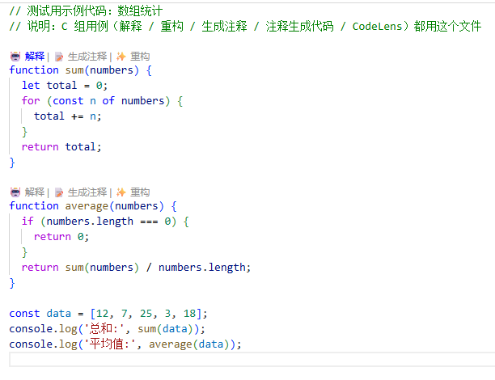

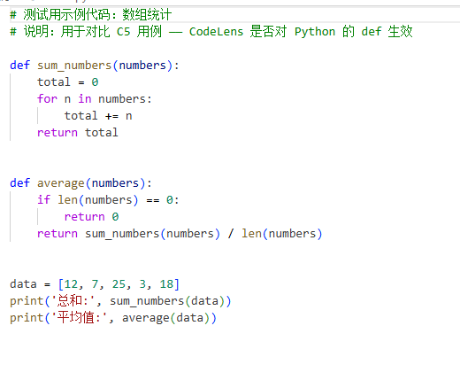

#### 问题 2：点函数上方的「解释」，解释的是整个文件

##### 现象

CodeLens 挂在某个函数上方，点击「🤖 解释」后，结果文档里解释的是**整个文件**，而不是那个函数。

##### 复现步骤

1. 用 VS Code 打开 `demo.js`。
2. **不要选中任何代码**（只在编辑器里放一个光标）。
3. 点击 `sum` 函数上方的「🤖 解释」。
4. 等它新开一个结果文档，看文档内容。

##### 实测结果

结果文档标题是「代码解释」，内容是：

> 这个代码定义了**两个函数**：`sum` 和 `average`，用于计算数组中的总和和平均值。它还包含一个**测试数据数组** `data`，用于验证函数的正确性。

它把两个函数和末尾的测试数据都讲了 —— 也就是**整个文件**，而点击的是 `sum` 上方的入口。

对照实验：「📝 生成注释」只动了 `sum` 一个函数，说明同一排按钮里有的能定位到函数、有的不能。

##### 原因（代码定位）

`out/features/commands.js:349-360` 里三个 CodeLens 挂在同一个 `range` 上，但传参不一样：

```js
new vscode.CodeLens(range, {
    title: '🤖 解释',
    command: 'ruyiCode.explain',
    arguments: [],                              // ← 空数组
}), new vscode.CodeLens(range, {
    title: '📝 生成注释',
    command: 'ruyiCode.commentForCode',
    arguments: [document.uri, start.line],      // ← 传了文档与行号
}), new vscode.CodeLens(range, {
    title: '✨ 重构',
    command: 'ruyiCode.refactor',
    arguments: [],                              // ← 空数组
}));
```

「生成注释」传了 `[document.uri, start.line]`，所以它知道自己在哪个函数上；
「解释」和「重构」传的是空数组，命令拿不到目标，只能退回到「当前选区」——没有选区时就处理整个文件。

三个入口在同一个循环里、共用同一个 `range`，`start.line` 就在作用域内，传参成本为零。因此这更像**漏传参数**，而不是有意的设计选择。

##### 影响

- 用户点「解释这个函数」，得到的是整个文件的解释，属于答非所问。
- 界面上没有任何提示说明范围被放大了，用户不一定意识到。
- 同一排按钮行为不一致，用户无法预期。

##### 证据

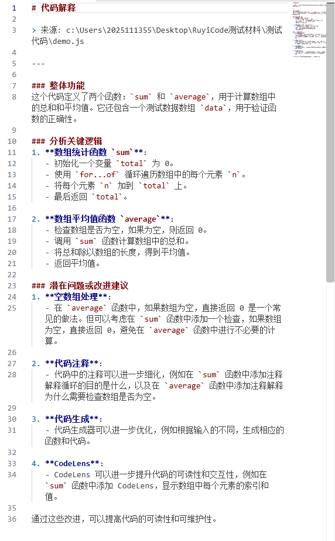


---

## 四、测试记录表

### 4.1 引擎测试情况

| 引擎 | 平台 | 是否测试 | 说明 |
|---|---|---|---|
| llama.cpp | Windows | ☑ 已测 | 引擎本身正常，浏览器访问 `http://127.0.0.1:8080/v1/models` 返回模型信息 |
| Ollama | Windows | ☐ 未测 | 本机未安装 |
| ruyi-server | Windows + WSL | ☐ 未测 | 缺少 llvm  buddy-mlir buddy-cli .rax|
| llama.cpp | Ubuntu | ☐ 未测 |  |
| Ollama | Ubuntu | ☐ 未测 |  |
| ruyi-server | Ubuntu | ☐ 未测 |  |

---


---

### 4.2 缺陷记录

| 编号 | 严重程度 | 现象描述 | 复现步骤 | 截图位置 |
|---|---|---|---|---|
| **B1** | ☐致命 ☐严重 ☑一般 ☐建议 | ① 面板拖窄到约 305 px 后，**刷新按钮 ↻ 与连接状态圆点被裁掉不可见**<br>② **点刷新不会更新连接状态圆点**：引擎正常（模型下拉框有内容），圆点却始终显示红色「未连接」，点 ↻ 也不变 | ① 拖动面板宽度观察顶部工具栏<br>② 观察圆点颜色 → 点 ↻ → 再看颜色是否变化 | `image/B1-1_面板过窄-刷新按钮与状态圆点被遮挡.png`、`image/B1-2_面板稍宽-刷新按钮与状态圆点可见.png`、`image/B1-3_刷新后状态圆点仍为红色.png` |
| **B3** | ☐致命 ☐严重 ☑一般 ☐建议 | 按 Esc（或点停止）取消生成后，**已输出的内容不会保留**，整块被替换成「生成失败: aborted」。文档 4-B3 要求「已输出内容保留」 | 发送长回答的问题（如「请你介绍一下 RISC-V」），中途按 Esc，观察原有内容是否还在 | `image/B3-1_生成中已输出内容.png`、`image/B3-2_按Esc后内容被替换为生成失败.png` |
| **B5** | ☐致命 ☑严重 ☐一般 ☐建议 | ① 模型看不到自己上一轮的回答<br>② 走「在对话中讨论选中代码」会残留一个**永久转圈的「●●●」气泡**（重复发送 `chatStart` 所致） | ① 第一轮问「你好」→ 第二轮追问「复述你刚给的代号」<br>② 选中代码 → 右键 → 在对话中讨论选中代码 → 观察对话区 | `image/B5-1_多轮追问答错代号.png`、`image/B5-2_讨论选中代码后残留转圈气泡.png` |
| **C3** | ☐致命 ☐严重 ☑一般 ☐建议 | 「生成注释」插入的是**注释包着重复代码** —— markdown 围栏、模型自己的 JSDoc、整段重复的函数体全被包进 `/** ... */`，共 16 行 | 打开 `demo.js`，点 `sum` 上方的「📝 生成注释」，观察插入内容 | `image/C3-1_生成注释插入了重复代码与围栏.png`、`image/C3-2_重复插入后的文件.png` |
| **C5** | ☐致命 ☐严重 ☑一般 ☐建议 | 代码提示入口（CodeLens）**只对 JavaScript 文件出现**，Python 文件的函数上方什么都不显示。文档 4-C5 的准备说明把 `.py` 与 `.js` 并列，认为两者都该出现 | 分别打开 `demo.js` 与 `demo.py`，观察函数名上方有无「解释 / 生成注释 / 重构」 | `image/C5-1_JS文件函数上方出现CodeLens.png`、`image/C5-2_Python文件函数上方没有CodeLens.png` |

---


---

## 五、已实测通过的部分

以下用例在实际界面操作中确认通过，记录在此以便与上面的缺陷对照。

| 用例 | 内容 | 实测结果 |
|---|---|---|
| **A2** | 引擎连接后点击状态栏徽章 | 弹窗文案与按钮符合预期：「引擎已连接，模型 qwen2.5-1.5b-instruct-q4_k_m，延迟 3ms。」按钮为 刷新 / 打开对话 / 配置路径。llama.cpp 模式下本就只有这三个按钮，与文档 4-A2 描述一致 |
| **B1** | 对话面板界面元素 | 顶部有模型下拉框（显示当前模型名）、刷新按钮 ↻、连接状态圆点（连接成功时显示） |
| **B2** | 输入问题后回答逐字流式出现 | 发送「你好」后回答「你好！有什么我可以帮助你的吗？」，文字逐字出现 |

---

## 附录一、测试用代码文件

复现步骤里用到的两个示例文件，内容如下。两者功能、函数数量、调用关系完全相同，唯一差别是语言，用于对比 CodeLens 的表现。

**demo.js**

```javascript
// 测试用示例代码：数组统计
// 说明：C 组用例（解释 / 重构 / 生成注释 / 注释生成代码 / CodeLens）都用这个文件

function sum(numbers) {
  let total = 0;
  for (const n of numbers) {
    total += n;
  }
  return total;
}

function average(numbers) {
  if (numbers.length === 0) {
    return 0;
  }
  return sum(numbers) / numbers.length;
}

const data = [12, 7, 25, 3, 18];
console.log('总和:', sum(data));
console.log('平均值:', average(data));
```

**demo.py**

```python
# 测试用示例代码：数组统计
# 说明：用于对比 C5 用例 —— CodeLens 是否对 Python 的 def 生效

def sum_numbers(numbers):
    total = 0
    for n in numbers:
        total += n
    return total


def average(numbers):
    if len(numbers) == 0:
        return 0
    return sum_numbers(numbers) / len(numbers)


data = [12, 7, 25, 3, 18]
print('总和:', sum_numbers(data))
print('平均值:', average(data))
```

## 附录二、截图清单

全部截图存放在与本报告同级的 `image/` 目录中。

| 关联缺陷 | 文件名 |
| --- | --- |
| A2-1 | `image/A2-1_引擎已连接弹窗.png` |
| A2-2 | `image/A2-2_对话面板与连接状态.png` |
| B1-1 | `image/B1-1_面板过窄-刷新按钮与状态圆点被遮挡.png` |
| B1-2 | `image/B1-2_面板稍宽-刷新按钮与状态圆点可见.png` |
| B1-3 | `image/B1-3_刷新后状态圆点仍为红色.png` |
| B3-1 | `image/B3-1_生成中已输出内容.png` |
| B3-2 | `image/B3-2_按Esc后内容被替换为生成失败.png` |
| B5-1 | `image/B5-1_多轮追问答错代号.png` |
| B5-2 | `image/B5-2_讨论选中代码后残留转圈气泡.png` |
| C2-1 | `image/C2-1_重构结果正常.png` |
| C3-1 | `image/C3-1_生成注释插入了重复代码与围栏.png` |
| C3-2 | `image/C3-2_重复插入后的文件.png` |
| C5-1 | `image/C5-1_JS文件函数上方出现CodeLens.png` |
| C5-2 | `image/C5-2_Python文件函数上方没有CodeLens.png` |
| C5-3 | `image/C5-3_点解释得到整个文件的解释.png` |
